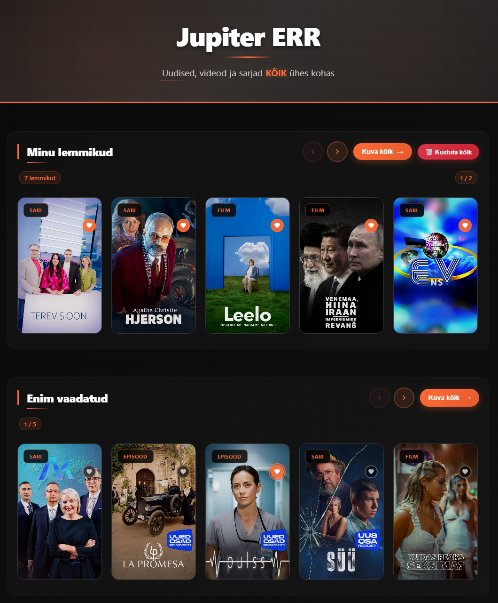

# 🎬 Jupiter ERR - Angular Video Platform



Modern Angular application recreating the Jupiter ERR video platform interface with responsive design and smooth user experience.

## ✨ Key Features

- 📱 **Responsive Design** - Works on desktop, tablet and mobile
- 🎥 **Video Content Browser** - Movies, series, documentaries
- ❤️ **Favorites System** - Save your favorite content
- 🔄 **Auto-carousel** - Automatic content scrolling (10s intervals)
- 🎯 **Direct Jupiter Links** - Click to open on Jupiter ERR platform
- ⚡ **Real-time API** - Live data from ERR API

## 🚀 Quick Start

### Prerequisites
- **Node.js** (v18+)
- **Angular CLI** (`npm install -g @angular/cli`)

### Installation

1. **Clone repository:**
```bash
git clone https://github.com/Artjomeller/Jupiter-ERR.git
cd Jupiter-ERR
```

2. **Install dependencies:**
```bash
npm install
```

3. **Start development server:**
```bash
ng serve
```

4. **Open browser:**
```
http://localhost:4200
```

## 🛠️ Technologies

- **Angular 17+** - Standalone components
- **TypeScript** - Type safety
- **SCSS** - Advanced styling
- **RxJS** - Reactive programming
- **ERR API** - Official content API

## 📱 Responsive Breakpoints

- **Desktop:** 1200px+
- **Tablet:** 768px - 1199px
- **Mobile:** 480px - 767px
- **Small Mobile:** < 480px

## 🔧 Development Scripts

```bash
ng serve          # Development server
ng build          # Production build
ng test           # Run tests
ng lint           # Code linting
```

## 📂 Project Structure

```
src/
├── app/
│   ├── components/
│   │   ├── content-item/         # Video cards
│   │   └── content-section/      # Category sections
│   ├── services/
│   │   └── api.service.ts        # ERR API integration
│   ├── models/
│   │   └── jupiter.models.ts     # TypeScript interfaces
│   └── app.component.*           # Main application
└── assets/
    └── images/                   # Static images
```

## 🎨 Design

- **Dark Theme** with orange accents (#ff6b35)
- **Glassmorphism** effects
- **Smooth animations** and hover effects
- **6 cards per row** with auto-carousel

## 🔗 API

Uses ERR's official API:
```
https://services.err.ee/api/v2/category/getByUrl?url=video&domain=jupiter.err.ee
```

## 👨‍💻 Author

**Artjom Eller**  
📧 artjomeller@outlook.com

## 📄 License

MIT License - see [LICENSE](LICENSE) file

---

🟢 **Active Development** - Project actively maintained and updated.
